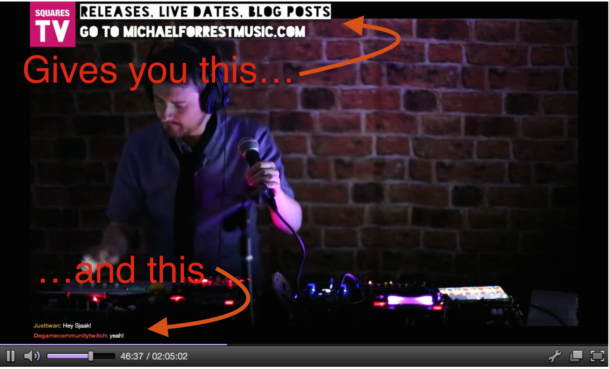

# Twitch Banner
This is a little app to let you show messages in your stream on Twitch, like the ones I have at [twitch.tv/michaelforrest](http://twitch.tv/michaelforrest).


##How to use

1) You'll need to install meteor following the instructions here: https://www.meteor.com/install

2) Clone this repository to you desktop. You can either download the GitHub app or use command line git. There should be instructions on GitHub on how to do this.

3) On the command line:

```
> cd path/to/twitch-banners
> meteor
```

4) Point your OBS Browser plugin to `http://localhost:3000` and you're in business.

## To change the text
Edit the file `twitch-banner.coffee`. It will automatically reload with each save.

##Questions?
Ask me on Twitter at [@mf_music](https://twitter.com/mf_music).
